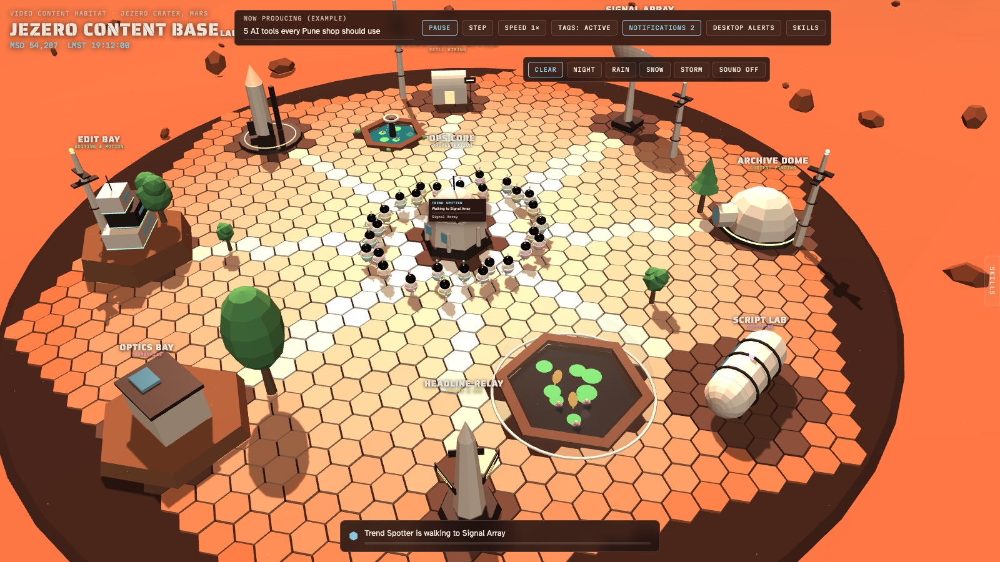
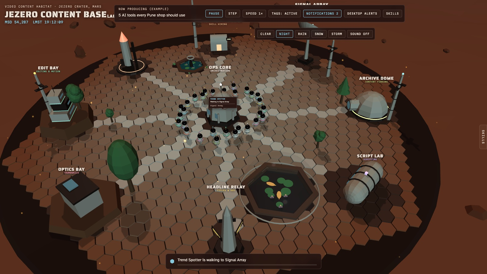
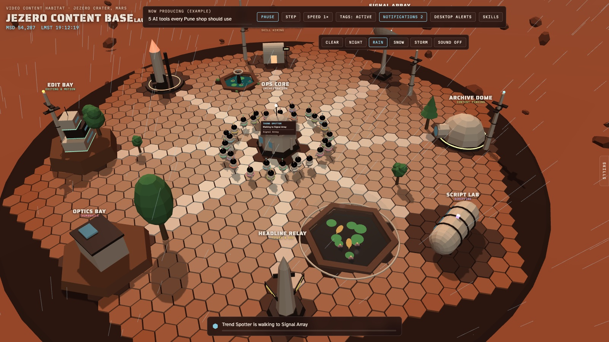
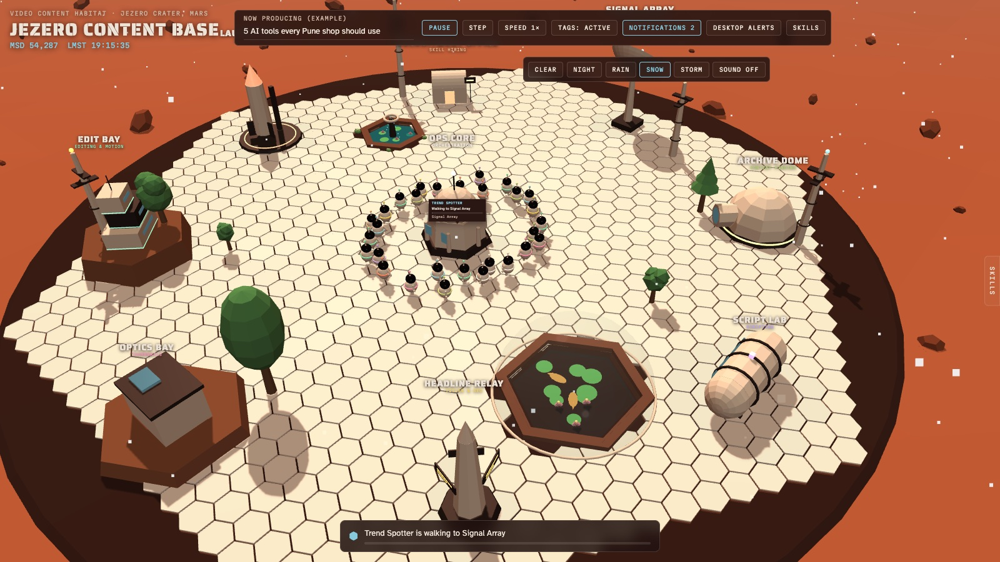
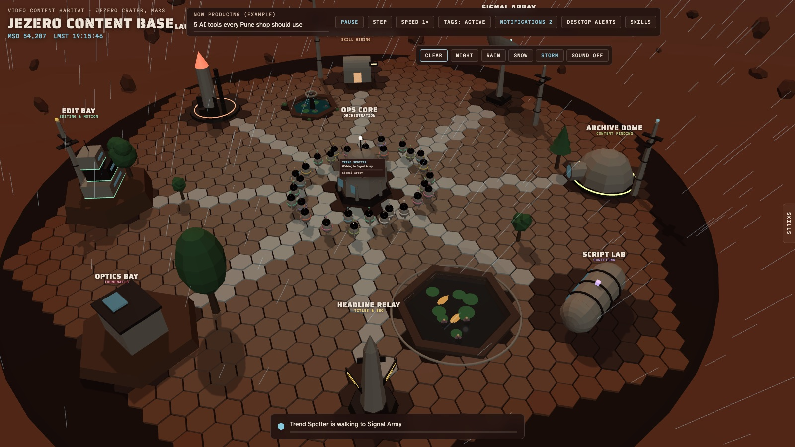
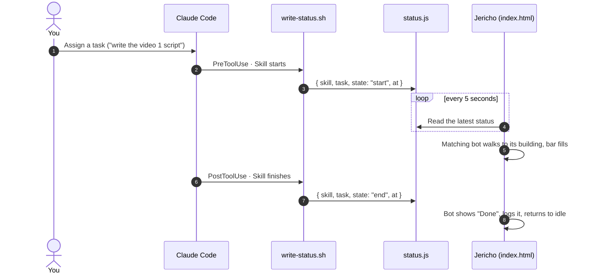
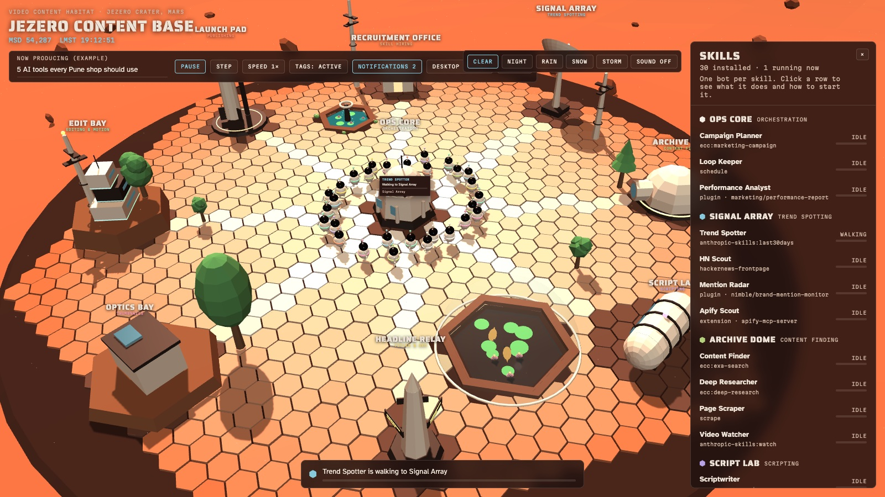
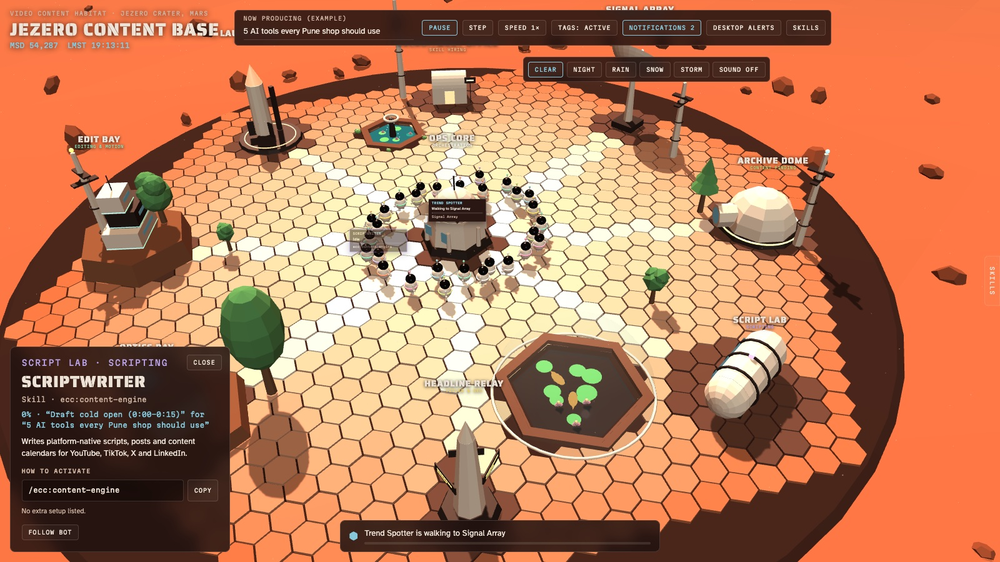
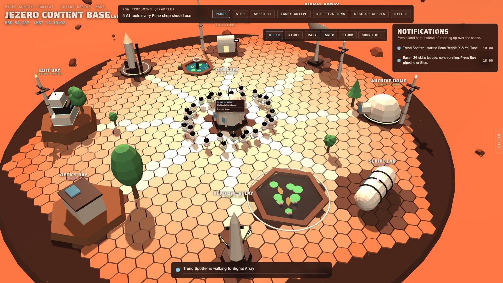

<p align="center">
  
</p>

<h1 align="center">Jericho Agentic Space Station</h1>

<p align="center">
  <b>A Mars base where every AI skill is a crew member, and you can see exactly which one is working.</b><br>
  <sub>One HTML file · no install · no build step · live status straight from Claude Code</sub>
</p>

---

Jericho is a 3D control room for an AI-assisted video workflow. Thirty Claude Code skills (trend spotting, research, scripting, titles, thumbnails, editing, publishing) each live on the station as a small, faceless bot. When one of them is actually running, its bot walks to the building where that kind of work happens, a progress bar fills above its head, and a single status line tells you what's going on.

When nothing is running, nothing moves. That's the point.

> The station is **Jericho**. It stands in **Jezero Crater**, which is why the in-app header reads *Jezero Content Base*.

---

## Why this exists

Running a faceless YouTube channel with thirty AI skills gets noisy fast. Work happens in terminal scrollback. You can't tell at a glance which skill is running, which is waiting, or whether anything is running at all, and every invisible step costs tokens.

Jericho replaces that fog with a room you can glance at:

- **Idle means idle.** No fake activity, no dashboard theatre. Bots stand still until a task is assigned.
- **One thing at a time.** The workflow runs step by step, one skill after another, so only one progress bar ever moves.
- **Calm by design.** No popups. Events collect quietly in a notifications panel you open when you want to.
- **Real, not decorative.** A Claude Code hook tells the page which skill actually started and finished.

---

## What you're looking at

| On screen | What it means |
|---|---|
| **A bot** | One installed skill, plugin or agent. Thirty in total. |
| **A building** | A category of work. Its label only ever shows its name and its job. |
| **A bot walking** | It's heading to the building where its next task belongs. Nothing is being carried. |
| **The bar above a bot** | How far through its current task that one bot is. Only the running bot has one. |
| **The strip at the bottom** | The single line of truth: who is working, on what, where, and how far along. |
| **Bots gathered round Ops Core** | The crew is idle and waiting for work. |
| **MSD / LMST, top left** | Real Mars time: the Mars Sol Date and Local Mean Solar Time at Jezero Crater, 77.45° E. |

---

## Five skies

Switch weather from the top-right bar. Each one changes the light, the particles and the sound.

<table>
  <tr>
    <td width="50%"><br><b>Clear</b>: butterscotch dusk, dust in the air, a soft wind.</td>
    <td width="50%"><br><b>Night</b>: stars overhead, tower beacons blinking, a low station hum.</td>
  </tr>
  <tr>
    <td width="50%"><br><b>Rain</b>: diagonal streaks falling right to left, a calm steady hiss.</td>
    <td width="50%"><br><b>Snow</b>: slow flakes that <i>settle</i>. The deck whitens tile by tile, following its exact hex cutout.</td>
  </tr>
  <tr>
    <td colspan="2"><br><b>Storm</b>: a storm front rings the base, lightning forks down to the deck, and thunder rolls in on cue with every strike.</td>
  </tr>
</table>

Every sound is **generated live in the browser** with the Web Audio API: wind, rain, snow hush, frogs and crickets at the pond, thunder, and a soft blip when a task starts. There are no audio files to download. Sound starts off; press **Sound off** to turn it on.

---

## How it works



Two modes, and the page never confuses them:

| Mode | When | What moves |
|---|---|---|
| **Live** | You open `index.html` from disk and the hook is installed | Only skills that are really running in Claude Code. Their notifications say *running for real*. |
| **Rehearsal** | You press **Run pipeline** or **Step** | A walk-through of the pipeline, one skill at a time, so you can see how the crew hands work along. |

The hook itself is about thirty lines of shell and Python standard library. It reads the hook payload Claude Code sends on stdin, pulls out the skill name and a short task label, and writes one line to `status.js`:

```js
window.JEZERO_STATUS = {"skill": "ecc:content-engine", "task": "Draft cold open", "state": "start", "at": "2026-09-18T10:22:04Z"};
```

The page loads that file as a script, so it works over `file://` with no server and no CORS.

---

## Quick start

**1. Open the station**

```bash
git clone https://github.com/Alistair77/Jericho-Agentic-Space-Station.git
open Jericho-Agentic-Space-Station/index.html
```

That's all it needs to run: a browser. three.js loads from cdnjs.

**2. Go live (optional).** Add the hook to `~/.claude/settings.json`, pointing at wherever you cloned the repo:

```json
"hooks": {
  "PreToolUse": [
    { "matcher": "Skill", "hooks": [{ "type": "command", "command": "/path/to/Jericho-Agentic-Space-Station/write-status.sh" }] }
  ],
  "PostToolUse": [
    { "matcher": "Skill", "hooks": [{ "type": "command", "command": "/path/to/Jericho-Agentic-Space-Station/write-status.sh" }] }
  ]
}
```

Restart Claude Code, keep `index.html` open from disk, and run any skill. Its bot starts moving within five seconds.

> A hosted copy of the page can't read your local `status.js`, so live mode needs the file opened from disk.

---

## Controls

| Control | What it does |
|---|---|
| **Run pipeline** / **Pause** | Rehearse the whole pipeline, one skill after another, with a pause between each. |
| **Step** | Run exactly one task, then stop. |
| **Speed** | 0.5×, 1× or 1.5×. Deliberately slow, so you can follow it by eye. |
| **Tags** | Show task panels for the *active* bot only (default), *all* bots, or *off*. |
| **Notifications** | Opens the event log. The number counts unread events. Click a row to jump to that bot. |
| **Desktop alerts** | A system notification when a skill starts while the tab is in the background. |
| **Skills** tab (right edge) | Pull out the full crew list: every skill, grouped by building, with its live state. |
| **Click any bot** | Its card: what the skill does, the exact command to run it, and any setup it needs. |
| **Drag / scroll** | Orbit and zoom the camera. **Follow bot** keeps the camera on the one you picked. |

**Open straight into a view** with URL switches. Handy for bookmarks:

| Switch | Example |
|---|---|
| `weather` | `index.html?weather=night` (also `clear`, `rain`, `snow`, `storm`) |
| `run` | `index.html?run=1` starts the rehearsal pipeline |
| `panel` | `index.html?panel=skills` or `?panel=notifications` |
| `select` | `index.html?select=ecc:content-engine` opens that skill's card |
| `bolt` | `index.html?weather=storm&bolt=1` holds a lightning bolt on screen |

<table>
  <tr>
    <td width="33%"><br><sub>The <b>Skills</b> pull tab</sub></td>
    <td width="33%"><br><sub>A skill card: what it does, how to run it</sub></td>
    <td width="33%"><br><sub>Notifications, collected instead of popped</sub></td>
  </tr>
</table>

---

## The crew

Thirty bots across nine buildings, each one a real installed skill, agent or plugin.

| Building | Its job | Crew |
|---|---|---|
| **Ops Core** | Orchestration | Campaign Planner · Loop Keeper · Performance Analyst |
| **Signal Array** | Trend spotting | Trend Spotter · HN Scout · Mention Radar · Apify Scout |
| **Archive Dome** | Content finding | Content Finder · Deep Researcher · Page Scraper · Video Watcher |
| **Script Lab** | Scripting | Scriptwriter · Voice Keeper |
| **Headline Relay** | Titles & SEO | Title Smith · SEO Mapper · Keyword Intel |
| **Optics Bay** | Thumbnails | Thumbnail Designer · Image Generator · Variant Tester · Template Thumbnailer |
| **Edit Bay** | Editing & motion | Editor · Motion Builder · Explainer Animator · Footage Indexer · Demo Recorder · Quick Cutter |
| **Launch Pad** | Publishing | Publisher · Crossposter · Postiz Scheduler |
| **Recruitment Office** | Skill hiring | Skill Recruiter |

<details>
<summary><b>Every bot and the skill behind it</b></summary>

| Bot | Skill / plugin | Building |
|---|---|---|
| Campaign Planner | `ecc:marketing-campaign` | Ops Core |
| Loop Keeper | `schedule` | Ops Core |
| Performance Analyst | `marketing/performance-report` · plugin | Ops Core |
| Trend Spotter | `anthropic-skills:last30days` | Signal Array |
| HN Scout | `hackernews-frontpage` | Signal Array |
| Mention Radar | `nimble/brand-mention-monitor` · plugin | Signal Array |
| Apify Scout | `apify-mcp-server` · extension | Signal Array |
| Content Finder | `ecc:exa-search` | Archive Dome |
| Deep Researcher | `ecc:deep-research` | Archive Dome |
| Page Scraper | `scrape` | Archive Dome |
| Video Watcher | `anthropic-skills:watch` | Archive Dome |
| Scriptwriter | `ecc:content-engine` | Script Lab |
| Voice Keeper | `ecc:brand-voice` | Script Lab |
| Title Smith | `marketing-agent` · agent | Headline Relay |
| SEO Mapper | `ecc:seo` | Headline Relay |
| Keyword Intel | `nimble/seo-intel` · plugin | Headline Relay |
| Thumbnail Designer | `banner-design` | Optics Bay |
| Image Generator | `ecc:fal-ai-media` | Optics Bay |
| Variant Tester | `design-shotgun` | Optics Bay |
| Template Thumbnailer | `adobe-for-creativity/adobe-design-from-template` · plugin | Optics Bay |
| Editor | `ecc:video-editing` | Edit Bay |
| Motion Builder | `ecc:remotion-video-creation` | Edit Bay |
| Explainer Animator | `ecc:manim-video` | Edit Bay |
| Footage Indexer | `ecc:videodb` | Edit Bay |
| Demo Recorder | `ecc:ui-demo` | Edit Bay |
| Quick Cutter | `adobe-for-creativity/adobe-edit-quick-cut` · plugin | Edit Bay |
| Publisher | `ecc:social-publisher` | Launch Pad |
| Crossposter | `ecc:crosspost` | Launch Pad |
| Postiz Scheduler | `postiz` · plugin | Launch Pad |
| Skill Recruiter | `anthropic-skills:find-skills` | Recruitment Office |

</details>

The **Skill Recruiter** is the station's HR desk. When a job comes up that no crew member covers, it searches the open skills registry, vets candidates by installs and GitHub stars, and brings back the best hire.

---

## Under the hood

| Piece | How it's built |
|---|---|
| **Scene** | three.js r128 from cdnjs, with OrbitControls. Low-poly, flat-shaded, soft shadows. |
| **Hex deck** | About 900 tiles drawn as instanced meshes, with walkways lit along the spokes and the pond cut cleanly out of the grid. |
| **Architecture** | Nine hand-built buildings, two raised on hex terraces with ramps, four comms towers, a lifted plinth on six legs. |
| **Pond** | A sunken hex basin with walls, a sandy floor, see-through water, lily pads, lotus flowers, and six fish circling underneath. |
| **Weather** | Rain as angled line streaks, snow as drifting points that settle into a per-tile snow cap, a storm front of low-poly cloud banks, and a forked bolt generated fresh for every strike. |
| **Sound** | All synthesised with the Web Audio API from filtered noise and oscillators. No audio files. |
| **Mars clock** | Mars Sol Date and Local Mean Solar Time computed with the Mars24 algorithm. |
| **Live status** | A Claude Code hook writes `status.js`; the page polls it every five seconds. |
| **Footprint** | One HTML file, one hook script. No npm, no bundler, nothing to install. |

---

## What it achieves

- **You always know what's running.** One glance at the bottom strip answers it, and the answer is true.
- **Nothing pretends to work.** The honest idle state was a deliberate rebuild: an earlier version showed thirty bots busy at once while nothing was actually running.
- **Your workflow reads as a place.** Thirty skills stop being a list of commands and become a crew with a home, a job and a route between buildings.
- **It stays out of your way.** No popups, slow deliberate motion, and every explanation written plainly. It's built for focus.
- **It costs nothing to run.** No server, no build, no dependencies. Open the file and it's there.

---

## Roadmap

- Show real progress from inside a running skill, not just start and finish
- Split the single file into scene, crew and weather modules
- Rename the in-app header to match the station's name
- Tighter layout for phones and small windows

---

<p align="center">
  Built by <b>Alistair</b>.<br>
  <sub>Jericho Agentic Space Station · Jezero Crater, Mars</sub>
</p>
